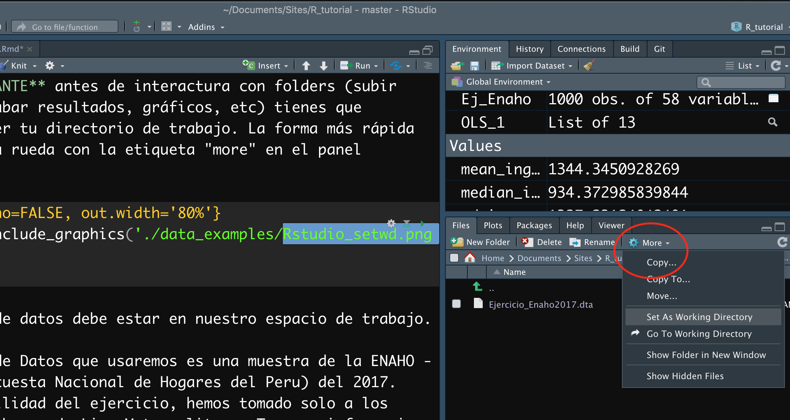

<style>
body {
text-align: justify}
</style>

```{r setup, include=FALSE}
library(lubridate)
fecha <- today(tzone = "America/Lima")
mes <- month(fecha, label = T, abbr = F, 
             #locale = "es_PE.utf8"
             )
```

**ULTIMA ACTUALIZACIÓN:**

La última actualización de este artículo se realizó el `r day(fecha)` de  `r mes` del `r year(fecha)`.

# Tabla de Contenidos

- [Subiendo bases de datos](#T1)
- [Manipular y limpiar base de datos](#T2)
- [Merge-Join bases](#T3)

# Subiendo una base de datos <a name="T1"></a>

Para subir una base de datos (BD), debes antes haber instalado una serie de paquetes que permiten leer la base de datos sin importar en que formato este. Existen varios paquetes que nos pueden ayudar con eso. En este tutorial trabajaremos con `rio`, que nos permite abrir distintos tipos de base de datos con facilidad. 

```{r, message=FALSE}
library(rio)
```

Segundo, llamamos a nuestra base de datos.

**IMPORTANTE** antes de interacturar con folders (subir data, grabar resultados, gráficos, etc) tienes que establecer tu directorio de trabajo. La forma más rápida es con la rueda con la etiqueta "more" en el panel derecho. 

```{r echo=FALSE, out.width='80%'}

```

La base de datos debe estar en nuestro espacio de trabajo. 

La Base de Datos que usaremos es una muestra de 1000 casos de la base **sumaria-2018.dta** de ENAHO - PERU (Encuesta Nacional de Hogares del Peru) del 2017. Aquí esta el link de donde pueden [descargarla](http://iinei.inei.gob.pe/iinei/srienaho/descarga/STATA/634-Modulo34.zip) en formato STATA. Tenemos informacion sobre ingresos, y gastos de los hogares en Perú. 

Dado que tenemos el paquete `rio`, no necesitamos decirle a R que nuestra base de datos está en STATA, R lo entiende. 

Vamos a usar la función `import()` y asignarle un nombre a nuestra base de datos. Lo llamaremos `s2018`. Abajo podemos ver las primeras 4 variables y primeras 10 observaciones.

```{r, echo=FALSE, message = FALSE}
library(dplyr)
set.seed(100)
s2018<-import("./data_examples/sumaria-2018.dta")%>%
  sample_n(1000)
```

```{r, eval = FALSE}
s2018<-import("./data_examples/sumaria-2018.dta")
```

Podemos usar `head()` en nuestra data para ver las primeras seis observaciones. Debido a que esta data cuenta con `r dim(s2018)[2]` columnas, usamos `[,1:5]` para que nos muestre sólo las 5 primeras.

```{r}
head(s2018)[,1:5]
```

Siempre es bueno mirar la base de datos con la cual estamos trabajando para darnos una idea mas concreta de que estamos haciendo. Primero debemos saber con que tipo de objeto estamos lidiando. La función `str()` nos brinda informaciòn útil sobre el objeto en cuestión y sus elementos. En el siguiente código, usamos `[,1:6]` para limitar la vista a las 6 primeras variables

```{r}
str(s2018[,1:6]) 
```
Vemos que las variables son de tipo 'chr', que quiere decir character o texto.  Asimismo, podemos ver que cada variable cuenta con dos espacios de `attr()`, estos son sus atributos. Más adelante veremos qué son y cómo utilizarlos. También vemos que el objeto `s2018` es un `data.frame`.


```{r}
is.data.frame(s2018) ## Es otra forma de comprobarlo.
```

En este caso `s2018` es un objeto de tipo `data.frame`, por lo que tiene dos dimensiones, saber esto es importante por que así podemos manipularlas. La función `dim()` nos permite ver ambas. El primer número se refiere a la cantidad de observaciones o casos (las filas) y el segundo a la cantidad de variables (las columnas).

```{r}
dim(s2018)
```

En el código debajo estamos seleccionando los 20 primeros casos (1:20), y las tres primeras variables (1:3). Conocer las dimensiones es útil para luego filtrar la base de datos. 

```{r}
s2018[1:20,1:3]
```

Si eres ansioso y quieres ver toda la base de datos puedes usar el siguiente código:

```{r, eval=FALSE}
View(s2018)
```

Podriamos mirar una muestra de nuestra base de datos con la opcion head. Abajo, le pedimos que nos puestre las 300 primeras observaciones. 

```{r, eval=FALSE}
View(head(s2018,300))
```

La función `import()` de rio permite subir archivos en distintos formatos. Existen otros paquetes como `foreign` que también hacen lo mismo. Pero `rio` me parece más conveniente.

# Manipular y limpiar base de datos <a name="T2"></a>

En esta secciones aprenderemos algunas de los pasos mas frecuentes que hacemos al encontrarnos con una nueva base de datos: limpiar y manipular algunas variables para que pueda analizarse. Debemos limpiar nuestra base de datos por muchas razones; quizas para calcular las variables que queremos, para desacernos de grupos de observaciones que no nos interesan o para hacer mas fácil el juntar nuestra base de datos con otras.

## Re-nombrar y etiquetar variables

Podemos llamar nuestras variables en la BD con la función `names()` o también `ls()`

```{r}
names(s2018)## Te los da en el orden en que estan en la base de datos. 
```

```{r, message=FALSE}
ls(s2018) ## Este comando te las da en nombre alfabetico
```

Por ejemplo la variable `inghog1d` (posición 141) es el ingreso bruto anual queremos cambiar el nombre a "ingreso_bruto".  

La forma más rápida es: 

```{r}
names(s2018)[141]<-"ingreso_bruto"
```

Si no tenemos la ubicación, quizás son miles de variables, podemos también usar 

```{r, eval=FALSE}
names(s2018[names(s2018) == "inghog1d"]) <-"ingreso_bruto"

# Si ya corriste el código anterior este te va a dar error, ya que 
# está buscando un nombre que no existe ;)
```

Pedimos el nombre de variables denuevo 
```{r}
names(s2018)[140:145] 
# Exacto! podemos indexar para no ver todas las variables nuevamente 
```

**Etiquetas**

Si subimos la base de datos desde STATA, estas pueden tener etiquetas. 

Por ejemplo, veamos la etiqueta de nuestra variables "ingreso_bruto" 

```{r}
attributes(s2018$ingreso_bruto)$label
```

Queremos cambiarla a "ingreso monetario (bruto) anual"

```{r}
attributes(s2018$ingreso_bruto)$label<-"ingreso monetario (bruto) anual"

#Veamos el cambio!
attributes(s2018$ingreso_bruto)$label 
```

## Recodificar variables

Ahora recodificaremos los valores de la variable con que estamos trabajando.

Usamos la funcion abajo para ver los valores y las etiquetas de la variable que creamos.

```{r}
attributes(s2018$estrsocial)$labels
```

Queremos recodificar los valores de **rural** de 6 a 0. 

```{r}
s2018[s2018$estrsocial==6,]$estrsocial<-0
```

Si pedimos una tabla vemos que el cambio se realizo:

```{r}
table(s2018$estrsocial)
```

Pero las etiquetas siguen mostrando el orden anterior

```{r}
attributes(s2018$estrsocial)$labels
```

```{r}
attributes(s2018$estrsocial)$labels[[1]]<-0
attributes(s2018$estrsocial)$labels
```

## Generar variables (categorica, dicotomica, average de grupo)

Ahora vamos a generar distintos tipos de variables. Empecemos con una variable dicotomica. Vamos a usar informacion sobre el ingreso reportado

## Variable categóricas

Generemos una variable que toma el valor de 1 si es que el informante gana más de 800 soles y 0 si es menos o igual. Creamos una variable vacia y le incluimos los argumentos:

- Forma 1:

```{r}
s2018$minimo<-NA
s2018[s2018$ingreso_bruto<=800,]$minimo<-0
s2018[s2018$ingreso_bruto>800,]$minimo<-1
table(s2018$minimo)
```

- Forma 2:

```{r}
s2018$minimo<-NA
s2018$minimo<-ifelse(s2018$ingreso_bruto<=800,0,1)
table(s2018$minimo)
```

- Forma 3: **USANDO DPLYR para crear nuevas variables**

Dplyr es un paquete que es muy útil para manipular data, es relativamente nuevo y cada vez está siendo más usado. 

Dplyr y Tydir son muy populares, así que es bueno ir familiarizandose con ellos. 

Lo especial de Dplyr es que tiene sus propias funciones y además que conecta funciones usando **%>%**. De esa manera puede ser más eficiente con el espacio de trabajo, evitando crear muchos objetos. 

En este caso la función es **mutate** 

```{r}
s2018<-s2018%>%mutate(minimo=ifelse(s2018$ingreso_bruto<=800,0,1))
table(s2018$minimo)
```

## Medidas por grupo. 

Por ejemplo queremos calcular el promedio de cada grupo. 
Usaremos **dplyr** para calcular el promedio de ingreso y la desviación estandar por cada ubigeo (municipalidad)

- Podemos concatenar funciones. Primero hemos "agrupado" la base de datos, luego hemos calculado el promedio, y la desviación estandard en base a la variable de agrupación.
- `arrange()` es para ordernar los ubigeos
- `select()` para quedarnos con algunas variables (son más de 150)
- `head()` para pedir los 6 primeros casos.


```{r}
s2018%>%group_by(ubigeo)%>%
  mutate(promedio=mean(ingreso_bruto),
         desv=sd(ingreso_bruto))%>%
  arrange(ubigeo)%>%
  select(c(1:3,160,161))%>%head()
```

Ahora bien los cambios no se han guardado en la base de datos para hacerlo debemos remplazar el objeto o crear uno nuevo. 

```{r, eval=FALSE}
s2018<-s2018%>%group_by(ubigeo)%>%
  mutate(promedio=mean(ingreso_bruto),
         desv=sd(ingreso_bruto))%>%
  arrange(ubigeo)### Aquí nuestra base ha cambiado ya que tiene dos variables más
```


# Merge y append bases de datos <a name="T3"></a>

- Creemos una base de datos que contenga el ingreso promedio por distrito. Similar a nuestro ejercicio anterior pero ahora la base será un objeto aparte. 


```{r}
resumen<-s2018%>%group_by(ubigeo)%>%
  summarise(promedio=mean(ingreso_bruto),
            desv=sd(ingreso_bruto))
head(resumen)
```

La diferencia aquí es que hemos usado ```summarise``` en lugar de ```mutate```. Ya que no estamos agregando una variable a la base. Estamos creando una nueva base. 

```{r}
nrow(resumen)
```

Ahora juntemos las bases de datos. El proceso es más conocido como "merge" o "join" 


```{r}
s2018<-s2018%>%left_join(resumen, by="ubigeo")
head(s2018[,c(6,159,160)])
```

Existen diferentes tipos de "join" 

  - `left_join()`
  - `rigth_join()`
  - `inner_join()`